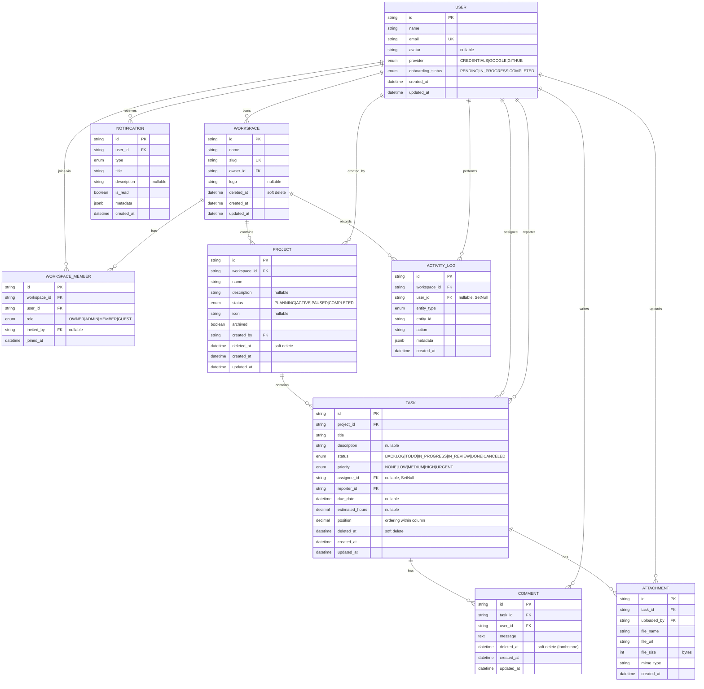

# FlowPilot — Backend & Database Architecture

**Phase 3 · Database & Backend Foundation**
Status: `AWAITING APPROVAL` — per rule 8, no implementation code ships until this document is signed off.
Stack: **PostgreSQL 15+ · Prisma ORM · Next.js 14 API routes · TypeScript (strict) · Zod**

---

## 1. Architecture at a glance

FlowPilot is a **single-database, shared-schema multi-tenant** system. Every tenant-owned row carries a `workspaceId` (directly, or transitively through its parent), and every query is scoped to a workspace membership before it touches data.

**Decision — shared schema over schema-per-tenant.**
*Why:* at FlowPilot's scale (thousands of workspaces, not thousands of enterprise DBs), schema-per-tenant multiplies migration cost and connection overhead for zero product benefit. Row-level scoping with strict service-layer guards is the industry default (Linear, ClickUp, Notion all run shared-schema). Postgres RLS can be layered on later without schema changes — that's our escape hatch, not our starting point (rule 5: avoid over-engineering).

**Request flow (every mutating request):**

```
HTTP → Zod validation → AuthN (session) → AuthZ (membership + permission)
     → Service (business rules, transactions) → Repository (Prisma, tenant-scoped)
     → Activity log emission → Typed response envelope
```

---

## 2. ER Diagram



---

## 3. Schema design decisions

| # | Decision | Why |
|---|----------|-----|
| 1 | **IDs = `cuid()`** (text) | Collision-free without coordination, URL-safe, no sequence hotspot, Prisma-native. UUIDv7 is the alternative; cuid keeps it simple and portable. |
| 2 | **`workspaceId` on Project + ActivityLog only; Task/Comment/Attachment scope through parent** | Normalized: a task's workspace is `task → project → workspace`. Avoids denormalized drift. Repos always join through project for tenancy checks. If profiling later shows hot cross-joins, denormalize `workspaceId` onto Task in one additive migration. |
| 3 | **Single `owner_id` on Workspace + `OWNER` role in members** | Owner is both: a fast pointer for billing/transfer logic, and a member row so permission checks stay uniform (one code path). Invariant enforced in service layer: exactly one member has role OWNER, and it matches `owner_id`. |
| 4 | **Task ordering = `position DECIMAL(20,10)`** | Drag-and-drop insert = midpoint of neighbors, no row rewrites. Periodic rebalance job when gaps get thin. Simpler than LexoRank, cheaper than integer reindexing. |
| 5 | **Statuses/priorities = Postgres enums (via Prisma)** | Matches the Phase-2 UI exactly. Custom per-project statuses are a known future need → will become a `project_statuses` table; enum keeps v1 simple and the migration path is additive. |
| 6 | **`metadata JSONB` on Notification + ActivityLog** | Flexible payloads (task ids, diffs, AI annotations) without schema churn — this is also the AI-readiness hook (§10). |
| 7 | **Hours = `DECIMAL(6,2)`, never float** | Floats drift; decimals don't. |
| 8 | **Email uniqueness, case-insensitive** | Stored lowercase-normalized at the service boundary + unique index. Avoids the citext extension dependency while guaranteeing case-insensitive uniqueness. |
| 9 | **Timestamps: `created_at` default now, `updated_at` Prisma `@updatedAt`, all `timestamptz`** | UTC everywhere; client renders local. |

### Foreign keys & referential actions

| Relation | On delete | Rationale |
|----------|-----------|-----------|
| Workspace → owner (User) | `Restrict` | A user who owns workspaces can't be hard-deleted; ownership must transfer first. User deletion = anonymization (GDPR-friendly), never cascade. |
| WorkspaceMember → Workspace | `Cascade` | Membership is meaningless without the workspace. |
| WorkspaceMember → User | `Cascade` | Row is pure join data. |
| WorkspaceMember.invited_by → User | `SetNull` | Historical breadcrumb, not a dependency. |
| Project → Workspace | `Cascade` | Fires only on true hard-purge (see soft delete). |
| Project.created_by → User | `Restrict` (anonymize instead) | Preserve attribution. |
| Task → Project | `Cascade` | |
| Task.assignee_id → User | `SetNull` | Task survives assignee's departure — becomes unassigned. |
| Task.reporter_id → User | `Restrict` (anonymize) | Attribution. |
| Comment / Attachment → Task | `Cascade` | |
| Notification → User | `Cascade` | Inbox is personal. |
| ActivityLog → Workspace | `Cascade` | Log dies with the tenant purge. |
| ActivityLog.user_id → User | `SetNull` | Audit rows outlive accounts ("Deleted user"). |

**Decision — cascades are the safety net, not the mechanism.** Product-level deletes are soft (below); DB cascades only execute during the scheduled hard-purge of soft-deleted tenants. This gives crash-consistent cleanup without risking accidental mass deletion from application bugs.

### Soft delete strategy

| Entity | Strategy | Why |
|--------|----------|-----|
| Workspace, Project, Task | `deleted_at TIMESTAMPTZ NULL` + 30-day purge job | Restore window, "trash" UX, mistake insurance. |
| Comment | `deleted_at` tombstone; UI shows "message deleted" | Thread continuity (like Slack). |
| Attachment | **Hard delete** row; object-storage file GC'd by nightly job | No restore need; storage costs real money. |
| Notification | Hard delete; 90-day TTL purge | Ephemeral by nature. |
| ActivityLog | **Never deleted** (append-only, immutable) | It *is* the audit trail. Purged only with tenant hard-purge. |

Enforcement: repositories apply `deleted_at IS NULL` by default via query helpers; `withDeleted()` is an explicit opt-in for trash views and the purge job. Partial indexes carry the same predicate so live-data queries stay index-only.

---

## 4. Index plan

Postgres does **not** auto-index FK columns — every FK used in joins gets one. Composite indexes are ordered (equality → range/sort) around real query shapes:

| Table | Index | Serves |
|-------|-------|--------|
| users | `UNIQUE(email)` | login, invite lookup |
| workspaces | `UNIQUE(slug)` (partial: live rows) | URL resolution; frees slug after delete |
| workspace_members | `UNIQUE(workspace_id, user_id)` | no duplicate membership; member list |
| workspace_members | `(user_id)` | "my workspaces" |
| projects | `(workspace_id, archived)` partial live | sidebar project list |
| tasks | `(project_id, status, position)` partial live | **the board query** — one column = one index range scan |
| tasks | `(assignee_id, status)` partial live | "My tasks" |
| tasks | `(project_id, due_date)` partial, non-null due | calendar / overdue |
| comments | `(task_id, created_at)` | thread, cursor-paged |
| attachments | `(task_id)` | task detail |
| notifications | `(user_id, is_read, created_at DESC)` | unread badge + inbox in one index |
| activity_logs | `(workspace_id, created_at DESC)` | workspace feed |
| activity_logs | `(entity_type, entity_id, created_at DESC)` | per-task/project history |

*Deliberately not indexed:* `tasks.title` (search arrives later via `pg_trgm` or embeddings — additive), lone low-cardinality booleans, anything without a known query.

---

## 5. Prisma schema (specification)

The approved-schema artifact; migrations are generated from this verbatim after sign-off.

```prisma
// prisma/schema.prisma
generator client {
  provider = "prisma-client-js"
}

datasource db {
  provider = "postgresql"
  url      = env("DATABASE_URL")
}

enum AuthProvider {
  CREDENTIALS
  GOOGLE
  GITHUB
}

enum OnboardingStatus {
  PENDING
  IN_PROGRESS
  COMPLETED
}

enum WorkspaceRole {
  OWNER
  ADMIN
  MEMBER
  GUEST
}

enum ProjectStatus {
  PLANNING
  ACTIVE
  PAUSED
  COMPLETED
}

enum TaskStatus {
  BACKLOG
  TODO
  IN_PROGRESS
  IN_REVIEW
  DONE
  CANCELED
}

enum TaskPriority {
  NONE
  LOW
  MEDIUM
  HIGH
  URGENT
}

enum NotificationType {
  TASK_ASSIGNED
  TASK_STATUS_CHANGED
  COMMENT_ADDED
  MENTION
  MEMBER_JOINED
  DUE_DATE_REMINDER
  AI_INSIGHT
}

enum EntityType {
  WORKSPACE
  PROJECT
  TASK
  COMMENT
  MEMBER
  ATTACHMENT
}

model User {
  id               String           @id @default(cuid())
  name             String
  email            String           @unique
  avatar           String?
  passwordHash     String?          @map("password_hash") // null for OAuth users
  provider         AuthProvider     @default(CREDENTIALS)
  onboardingStatus OnboardingStatus @default(PENDING) @map("onboarding_status")
  createdAt        DateTime         @default(now()) @map("created_at")
  updatedAt        DateTime         @updatedAt @map("updated_at")

  ownedWorkspaces Workspace[]       @relation("WorkspaceOwner")
  memberships     WorkspaceMember[] @relation("MemberUser")
  sentInvites     WorkspaceMember[] @relation("MemberInviter")
  createdProjects Project[]         @relation("ProjectCreator")
  assignedTasks   Task[]            @relation("TaskAssignee")
  reportedTasks   Task[]            @relation("TaskReporter")
  comments        Comment[]
  attachments     Attachment[]
  notifications   Notification[]
  activities      ActivityLog[]

  @@map("users")
}

model Workspace {
  id        String    @id @default(cuid())
  name      String
  slug      String    @unique
  ownerId   String    @map("owner_id")
  logo      String?
  deletedAt DateTime? @map("deleted_at")
  createdAt DateTime  @default(now()) @map("created_at")
  updatedAt DateTime  @updatedAt @map("updated_at")

  owner      User              @relation("WorkspaceOwner", fields: [ownerId], references: [id], onDelete: Restrict)
  members    WorkspaceMember[]
  projects   Project[]
  activities ActivityLog[]

  @@index([ownerId])
  @@map("workspaces")
}

model WorkspaceMember {
  id          String        @id @default(cuid())
  workspaceId String        @map("workspace_id")
  userId      String        @map("user_id")
  role        WorkspaceRole @default(MEMBER)
  invitedBy   String?       @map("invited_by")
  joinedAt    DateTime      @default(now()) @map("joined_at")

  workspace Workspace @relation(fields: [workspaceId], references: [id], onDelete: Cascade)
  user      User      @relation("MemberUser", fields: [userId], references: [id], onDelete: Cascade)
  inviter   User?     @relation("MemberInviter", fields: [invitedBy], references: [id], onDelete: SetNull)

  @@unique([workspaceId, userId])
  @@index([userId])
  @@map("workspace_members")
}

model Project {
  id          String        @id @default(cuid())
  workspaceId String        @map("workspace_id")
  name        String
  description String?
  status      ProjectStatus @default(PLANNING)
  icon        String?
  archived    Boolean       @default(false)
  createdBy   String        @map("created_by")
  deletedAt   DateTime?     @map("deleted_at")
  createdAt   DateTime      @default(now()) @map("created_at")
  updatedAt   DateTime      @updatedAt @map("updated_at")

  workspace Workspace @relation(fields: [workspaceId], references: [id], onDelete: Cascade)
  creator   User      @relation("ProjectCreator", fields: [createdBy], references: [id], onDelete: Restrict)
  tasks     Task[]

  @@index([workspaceId, archived])
  @@map("projects")
}

model Task {
  id             String       @id @default(cuid())
  projectId      String       @map("project_id")
  title          String
  description    String?
  status         TaskStatus   @default(BACKLOG)
  priority       TaskPriority @default(NONE)
  assigneeId     String?      @map("assignee_id")
  reporterId     String       @map("reporter_id")
  dueDate        DateTime?    @map("due_date")
  estimatedHours Decimal?     @map("estimated_hours") @db.Decimal(6, 2)
  position       Decimal      @db.Decimal(20, 10)
  deletedAt      DateTime?    @map("deleted_at")
  createdAt      DateTime     @default(now()) @map("created_at")
  updatedAt      DateTime     @updatedAt @map("updated_at")

  project     Project      @relation(fields: [projectId], references: [id], onDelete: Cascade)
  assignee    User?        @relation("TaskAssignee", fields: [assigneeId], references: [id], onDelete: SetNull)
  reporter    User         @relation("TaskReporter", fields: [reporterId], references: [id], onDelete: Restrict)
  comments    Comment[]
  attachments Attachment[]

  @@index([projectId, status, position])
  @@index([assigneeId, status])
  @@index([projectId, dueDate])
  @@map("tasks")
}

model Comment {
  id        String    @id @default(cuid())
  taskId    String    @map("task_id")
  userId    String    @map("user_id")
  message   String
  deletedAt DateTime? @map("deleted_at")
  createdAt DateTime  @default(now()) @map("created_at")
  updatedAt DateTime  @updatedAt @map("updated_at")

  task Task @relation(fields: [taskId], references: [id], onDelete: Cascade)
  user User @relation(fields: [userId], references: [id], onDelete: Restrict)

  @@index([taskId, createdAt])
  @@map("comments")
}

model Attachment {
  id         String   @id @default(cuid())
  taskId     String   @map("task_id")
  uploadedBy String   @map("uploaded_by")
  fileName   String   @map("file_name")
  fileUrl    String   @map("file_url")
  fileSize   Int      @map("file_size")
  mimeType   String   @map("mime_type")
  createdAt  DateTime @default(now()) @map("created_at")

  task     Task @relation(fields: [taskId], references: [id], onDelete: Cascade)
  uploader User @relation(fields: [uploadedBy], references: [id], onDelete: Restrict)

  @@index([taskId])
  @@map("attachments")
}

model Notification {
  id          String           @id @default(cuid())
  userId      String           @map("user_id")
  type        NotificationType
  title       String
  description String?
  isRead      Boolean          @default(false) @map("is_read")
  metadata    Json             @default("{}")
  createdAt   DateTime         @default(now()) @map("created_at")

  user User @relation(fields: [userId], references: [id], onDelete: Cascade)

  @@index([userId, isRead, createdAt(sort: Desc)])
  @@map("notifications")
}

model ActivityLog {
  id          String     @id @default(cuid())
  workspaceId String     @map("workspace_id")
  userId      String?    @map("user_id")
  entityType  EntityType @map("entity_type")
  entityId    String     @map("entity_id")
  action      String     // namespaced verb, e.g. "task.status_changed"
  metadata    Json       @default("{}")
  createdAt   DateTime   @default(now()) @map("created_at")

  workspace Workspace @relation(fields: [workspaceId], references: [id], onDelete: Cascade)
  user      User?     @relation(fields: [userId], references: [id], onDelete: SetNull)

  @@index([workspaceId, createdAt(sort: Desc)])
  @@index([entityType, entityId, createdAt(sort: Desc)])
  @@map("activity_logs")
}
```

Notes: partial indexes (`WHERE deleted_at IS NULL`) aren't expressible in Prisma DSL — they're added as raw SQL inside the generated migration (standard practice, §12). `action` is a namespaced string, not an enum, so new activity verbs never require a migration. `passwordHash` was added to the given spec — credentials auth is impossible without it; it's nullable for OAuth users.

---

## 6. Backend folder structure

```
src/
├── server/
│   ├── db/
│   │   ├── client.ts            # Prisma singleton (hot-reload safe)
│   │   └── helpers.ts           # notDeleted(), cursor helpers, tx types
│   ├── repositories/            # DATA ACCESS ONLY — no business rules
│   │   ├── user.repository.ts
│   │   ├── workspace.repository.ts
│   │   ├── member.repository.ts
│   │   ├── project.repository.ts
│   │   ├── task.repository.ts
│   │   ├── comment.repository.ts
│   │   ├── attachment.repository.ts
│   │   ├── notification.repository.ts
│   │   └── activity.repository.ts
│   ├── services/                # BUSINESS RULES — permissions, transactions, side effects
│   │   ├── auth.service.ts
│   │   ├── workspace.service.ts
│   │   ├── project.service.ts
│   │   ├── task.service.ts
│   │   ├── comment.service.ts
│   │   └── notification.service.ts
│   ├── validators/              # Zod schemas = single source of truth for DTOs
│   │   ├── common.ts            # id, slug, pagination, envelope
│   │   ├── auth.schema.ts
│   │   ├── workspace.schema.ts
│   │   ├── project.schema.ts
│   │   ├── task.schema.ts
│   │   ├── comment.schema.ts
│   │   └── notification.schema.ts
│   ├── permissions/
│   │   ├── roles.ts             # role → permission matrix (static, typed)
│   │   └── guard.ts             # requireMember(), requirePermission()
│   ├── utils/
│   │   ├── errors.ts            # AppError hierarchy + HTTP mapping
│   │   ├── pagination.ts        # encode/decode cursors
│   │   └── slug.ts
│   └── types/
│       ├── api.ts               # ApiResponse<T>, ApiError envelopes
│       └── context.ts           # AuthContext { userId, workspaceId?, role? }
```

**Layer contract (Repository Pattern Guide):**

| Layer | Owns | Never does |
|-------|------|-----------|
| **Route handler** (`app/api/...`) | HTTP parsing, calls validator → service, maps AppError → status | business logic, direct Prisma |
| **Validator** (Zod) | shape + type coercion; DTOs via `z.infer` | DB access |
| **Service** | permission checks, invariants, `$transaction`, activity log + notification emission | raw SQL, HTTP concerns |
| **Repository** | Prisma queries, tenancy scoping (`workspaceId` is a *required* param on every method), soft-delete filters | permission decisions |

*Why repositories at all (vs. Prisma directly in services)?* Two concrete wins, not dogma: (1) tenancy and soft-delete filters live in exactly one place per entity — the class of bug "forgot the workspaceId where-clause" becomes structurally impossible; (2) unit tests mock a 6-method interface instead of the Prisma client. We deliberately skip generic `BaseRepository<T>` abstractions — each repo is a flat, readable file (rule 6).

**DTO strategy:** input DTOs are `z.infer<typeof createTaskSchema>` — validators are the single source of truth. Output DTOs are explicit `select` shapes in repositories (never `SELECT *` leaks of `passwordHash`).

**Error strategy:** one `AppError(code, httpStatus, message, details?)` hierarchy — `ValidationError(400)`, `UnauthorizedError(401)`, `ForbiddenError(403)`, `NotFoundError(404)`, `ConflictError(409)`, `RateLimitError(429)`. Services throw; a single route-level handler serializes. Unknown errors → 500 with logged correlation id, never a stack trace in the response.

---

## 7. Permissions (RBAC)

Roles are per-workspace (a user can be OWNER of one workspace, GUEST in another). The matrix is a static typed map — no DB round-trip to evaluate:

| Permission | OWNER | ADMIN | MEMBER | GUEST |
|------------------|:---:|:---:|:---:|:---:|
| manage_workspace (rename, logo, delete, transfer) | ✅ | — | — | — |
| manage_members (invite, remove, change roles) | ✅ | ✅ | — | — |
| create_project | ✅ | ✅ | ✅ | — |
| delete_project | ✅ | ✅ | — | — |
| create_task / edit_task | ✅ | ✅ | ✅ | — |
| delete_task | ✅ | ✅ | own only* | — |
| comment | ✅ | ✅ | ✅ | ✅ |
| view | ✅ | ✅ | ✅ | ✅ |

\* "own only" = reporter of the task; expressed as a **resource rule**, see below.

```ts
// permissions/roles.ts  (specification)
const ROLE_PERMISSIONS: Record<WorkspaceRole, ReadonlySet<Permission>> = { ... };

// permissions/guard.ts
can(ctx: AuthContext, permission: Permission): boolean            // static matrix
canOnResource(ctx, permission, resource): boolean                 // matrix + ownership rules
requirePermission(ctx, permission, resource?): void               // throws ForbiddenError
```

**Why this scales:** adding a permission = one union-type member + matrix rows (compiler forces every role to answer). Adding resource-level nuance = one rule function. If custom roles ever ship, the static map swaps for a DB-backed map behind the same `can()` signature — call sites never change.

**Guard order on every request:** session → membership fetch (workspace from URL) → `requirePermission`. Membership is fetched once per request and memoized on the context.

---

## 8. API design

REST under `/api/v1`. Envelope:

```jsonc
// success                          // error
{ "data": { ... },                  { "error": {
  "meta": { "nextCursor": "…" } }       "code": "FORBIDDEN",
                                        "message": "You can't delete this project.",
                                        "details": [ ... ] } }
```

Auth is session-cookie based (Auth.js v5 — credentials + Google + GitHub, matching the Phase-2 UI).

| Endpoint | Method | Request (Zod) | Success | Errors |
|----------|--------|---------------|---------|--------|
| `/auth/signup` | POST | `{name 1-80, email, password ≥8}` | `201 {user, session}` | 400 validation · 409 `EMAIL_TAKEN` · 429 |
| `/auth/login` | POST | `{email, password}` | `200 {user, session}` | 400 · 401 `INVALID_CREDENTIALS` (same for both fields — no user enumeration) · 429 |
| `/auth/session` | GET | — | `200 {user}` \| `200 {user:null}` | — |
| `/workspaces` | GET | — | `200 {data: WorkspaceSummary[]}` | 401 |
| `/workspaces` | POST | `{name 1-60, slug /^[a-z0-9-]{3,32}$/}` | `201 {workspace}` | 400 · 409 `SLUG_TAKEN` |
| `/workspaces/:slug` | GET/PATCH/DELETE | PATCH `{name?, logo?, slug?}` | 200 / 200 / `204` (soft) | 401 · 403 `manage_workspace` · 404 · 409 |
| `/workspaces/:slug/members` | GET/POST/PATCH/DELETE | POST `{email, role≠OWNER}` | 200/201/200/204 | 403 `manage_members` · 404 · 409 `ALREADY_MEMBER` · 422 `LAST_OWNER` |
| `/workspaces/:slug/projects` | GET/POST | POST `{name 1-80, description?, icon?}` | 200 (paged) / 201 | 403 `create_project` |
| `/projects/:id` | GET/PATCH/DELETE | PATCH partial | 200 / 200 / 204 (soft) | 403 · 404 (also returned for cross-tenant ids — no existence leaks) |
| `/projects/:id/tasks` | GET/POST | GET `{status?, assigneeId?, cursor?, limit≤100}` · POST `{title 1-200, …}` | 200 (cursor-paged) / 201 | 400 `INVALID_CURSOR` · 403 `create_task` |
| `/tasks/:id` | GET/PATCH/DELETE | PATCH partial incl. `{status?, position?}` (move) | 200 / 200 / 204 (soft) | 403 · 404 · 409 `STALE_POSITION` |
| `/tasks/:id/comments` | GET/POST | POST `{message 1-4000}` | 200 (cursor) / 201 | 403 `comment` · 404 |
| `/comments/:id` | PATCH/DELETE | `{message}` | 200 / 204 (tombstone) | 403 (author or admin) · 404 |
| `/notifications` | GET | `{unreadOnly?, cursor?, limit≤50}` | 200 (cursor) | 401 |
| `/notifications/read` | POST | `{ids: string[] ≤100}` or `{all: true}` | `200 {updated: n}` | 400 |

Design notes: workspace addressed by **slug** (URL-stable, human-readable); child resources by id. `PATCH /tasks/:id` doubles as the drag-drop move endpoint — status+position update in one transaction, activity-logged as `task.moved`.

---

## 9. Performance

- **Pagination = cursor everywhere lists grow unbounded** (tasks, comments, notifications, activity). Cursor = base64 of `(createdAt, id)` — stable under inserts, no OFFSET scans. Offset paging only for member lists (bounded small).
- **Board query** is a single index-range scan per status column via `(project_id, status, position)`. Full board = one query, grouped in memory — not N queries.
- **N+1 discipline:** repositories expose list methods with explicit `include`/`select`; assignee avatars come via one `IN` batch, not per-row lazy loads.
- **Transactions** (`prisma.$transaction`, interactive): workspace create (workspace + OWNER member + activity), invite accept, task move (position + log), ownership transfer (two member rows + owner_id). Everything else is single-statement and needs none.
- **Position rebalance:** when neighbor gap < 1e-9, service triggers an in-transaction renumber of that column (rare, bounded to one status column).
- **Caching (in order of payoff):** 1) session/user in the JWT (zero DB hits per request for authn) · 2) per-request memo of membership · 3) Redis only when measured hot (workspace summaries, unread counts). No cache invalidation architecture before there's evidence (rule 5).
- **Connection pooling:** serverless deploy target ⇒ PgBouncer / Prisma Accelerate in front of Postgres; pool size documented in `.env.example`.

## 10. AI-readiness (design hooks, zero cost today)

1. **ActivityLog is an append-only event stream** — exactly the corpus an AI copilot needs for "what happened this sprint" summaries and risk prediction. `metadata` JSONB carries diffs.
2. **`estimated_hours` + status timestamps** (derivable from activity log) → training data for estimate suggestions.
3. **`NotificationType.AI_INSIGHT`** already reserved — AI outputs flow through the existing notification pipe.
4. **pgvector** is one `CREATE EXTENSION` + one additive `task_embeddings` table away; nothing in this schema blocks it.
5. Repository pattern gives AI features a clean read API without touching route code.

## 11. Security

- **Input:** every route parses body/query through Zod before any logic; unknown keys stripped (`.strict()` on create schemas).
- **AuthZ:** guard order is structural (route template includes `requirePermission`); cross-tenant probes return 404, not 403, to avoid existence leaks.
- **SQL injection:** Prisma parameterizes everything; raw SQL is confined to migrations and the (parameterized) rebalance statement — code review rule: no `$queryRawUnsafe`.
- **Passwords:** argon2id (memory-hard), never bcrypt-with-low-rounds; generic 401 on login failure; no user enumeration on signup (409 is rate-limited).
- **Rate limiting:** sliding window on auth routes (5/min/IP + 10/min/email) and invite sends; 429 with `Retry-After`. Upstash Redis or in-memory token bucket for single-instance dev.
- **Audit:** ActivityLog doubles as the audit trail (immutable, SetNull on user deletion keeps rows). Sensitive admin actions (role change, member removal, workspace delete) always logged with actor + before/after in metadata.
- **Secrets/PII:** `passwordHash` never leaves the repository layer (excluded from every `select`); logs scrub emails.

## 12. Migration strategy

- `prisma migrate dev` locally, `prisma migrate deploy` in CI — never `db push` outside prototypes.
- **One migration per PR**, named `NNN_verb_noun`; migration #1 = full baseline from §5, migration #2 = raw-SQL partial indexes (Prisma DSL can't express them; checked in and reviewed like code).
- **Expand → migrate → contract** for any breaking change: add nullable column → backfill → tighten. No destructive DDL in the same release that stops writing the old shape.
- Migrations run before deploy (CI step), app version N must run against schema N and N+1.

## 13. Seed strategy

`prisma/seed.ts` (idempotent — `upsert` by natural keys, safe to re-run):

- 4 users matching the Phase-2 design fixtures: Mara Kis (owner), Jonas Reid, Amara Osei, Theo Park — password `demo1234`, onboarding COMPLETED.
- Workspace **Acme Inc.** (`acme`) with roles OWNER/ADMIN/MEMBER/GUEST — one of each, so every permission branch is testable.
- 3 projects (Checkout revamp · Mobile app beta · SOC 2 readiness) with statuses spread.
- ~24 tasks across all statuses/priorities with realistic positions, a comment thread, 2 attachments (fake URLs), notifications (read+unread), and ~30 activity rows so feeds render.
- Guarded: refuses to run when `NODE_ENV=production` unless `SEED_FORCE=1`.

---

## 14. Assessment

**Architecture score: 87/100**

| Area | Score | Note |
|------|------:|------|
| Data model & integrity | 23/25 | Normalized, invariants named; custom statuses deferred (known debt) |
| Multi-tenancy & security | 22/25 | Structural scoping; RLS deliberately deferred — the honest −3 |
| API & DX | 18/20 | Typed end-to-end, predictable envelope; no OpenAPI generation yet |
| Performance | 15/15 | Indexes match query shapes; cursor paging; measured-first caching |
| Simplicity / maintainability | 9/15 | Repos + services + validators is 3 layers — justified here, but it *is* ceremony a 2-person team must keep honest |

**Risks & assumptions**
- *Assumes* Next.js API routes (no separate backend service) — right until websockets/realtime demand a dedicated process.
- *Assumes* single Postgres region; multi-region tenancy is a different architecture.
- *Risk:* soft-delete filters are convention-enforced (repo helpers). Mitigation: repo tests assert every list method excludes deleted rows; RLS is the upgrade path.
- *Risk:* activity_logs is the fastest-growing table. Mitigation: append-only, two indexes only, monthly partitioning ready via `created_at` when it passes ~50M rows.
- *Risk:* enum statuses will collide with "custom workflows" roadmap — migration path documented (§3.5), cost is one additive table + backfill.

**Future scalability concerns:** realtime collaboration (Postgres LISTEN/NOTIFY → dedicated ws service), notification fanout at big-org scale (move creation to a queue), attachment storage quotas per workspace, read replicas for analytics endpoints.

## 15. Implementation plan (small, reviewable commits)

1. `chore(db)`: Prisma + Postgres docker-compose + env plumbing; empty client singleton.
2. `feat(db)`: schema.prisma (§5) + baseline migration.
3. `feat(db)`: raw-SQL partial indexes migration + seed script.
4. `feat(server)`: errors, types, response envelope, pagination utils.
5. `feat(server)`: permissions module (matrix + guards) + unit tests.
6. `feat(server)`: validators for all entities (Zod) + inferred DTOs.
7. `feat(server)`: user/workspace/member repositories + services + tests.
8. `feat(api)`: auth routes (Auth.js wiring, signup/login/session) + rate limits.
9. `feat(api)`: workspace + member routes.
10. `feat(server+api)`: project repo/service/routes.
11. `feat(server+api)`: task repo/service/routes incl. move/reorder transaction.
12. `feat(server+api)`: comments, attachments (metadata only), notifications.
13. `feat(server)`: activity log emission across services + feed endpoint.
14. `chore`: purge/TTL jobs (workspace hard-purge, notification TTL) + docs pass.

Each commit ≤ ~400 lines of diff, independently revertible, tests included in the same commit.

---

*Sign-off below this line to unlock implementation (commits 1–3 first).*

