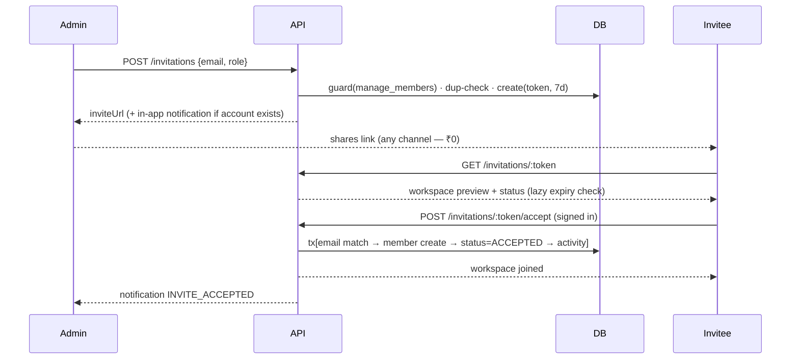

# FlowPilot — Phase 4: Workspace Management (Architecture Addendum)

Extends `docs/backend-architecture.md`. Phase 3 already shipped workspace/member CRUD, RBAC guards, tenant isolation, and rate limiting — **this phase only adds what's new** and amends one permission. Patterns (validators → guards → services → repositories) are reused verbatim; zero new libraries.

**Understanding score: 92/100.** Deductions: the prompt's email-sending expectation conflicts with the zero-cost constraint (resolved below with invite links), and "workspace archive" semantics weren't defined in Phase 3 (defined below).

---

## 1. What's already done vs. new

| Prompt feature | Status |
|---|---|
| Workspace create/update/delete, slug, auto-Owner | ✅ Phase 3 |
| Members list / role change / remove, RBAC guards, tenant isolation | ✅ Phase 3 |
| Rate limiting, cursor pagination, notifications pipe | ✅ Phase 3 |
| **Invitation system (token, states, expiry, revoke, resend)** | 🆕 this phase |
| **Workspace settings (timezone, date format, default view, notif prefs)** | 🆕 this phase |
| **Workspace switching + last-active persistence** | 🆕 this phase |
| **Workspace color/icon, archive** | 🆕 this phase |
| **Last Active tracking on members** | 🆕 this phase |
| Switcher/settings/member-table UI | 🔜 next step (frontend), plan in §8 |

## 2. Amendments to Phase 3 decisions

1. **Permission split** (prompt's matrix wins): `manage_workspace` → `update_workspace` (Owner + Admin) and `delete_workspace` (Owner only). Archive counts as *update*; delete stays Owner-only. Call sites change in one file each — this is why permissions were centralized.
2. **Direct member-add stays** (`POST /members`) for teammates who already have accounts; the invitation system covers everyone else. Two doors, same guard (`manage_members`).
3. **Email sending: none in v1.** Invitations produce a **link** (`/invite/<token>`) returned to the admin to share anywhere — ₹0, no signup, no deliverability headaches. If a the invitee already has a FlowPilot account, they also get an in-app notification. Resend (3k emails/mo free) can be slotted into `invitation.service.send()` later without touching the flow.

## 3. Database changes (all additive — one migration)

```prisma
enum InvitationStatus { PENDING ACCEPTED REJECTED EXPIRED REVOKED }

model WorkspaceInvitation {
  id          String           @id @default(cuid())
  workspaceId String           @map("workspace_id")
  email       String           // normalized lowercase
  token       String           @unique // 32-byte random, base64url — the capability
  role        WorkspaceRole    @default(MEMBER) // never OWNER
  invitedBy   String?          @map("invited_by")
  status      InvitationStatus @default(PENDING)
  expiresAt   DateTime         @map("expires_at") // created_at + 7 days
  createdAt   DateTime         @default(now()) @map("created_at")
  // relations: workspace (Cascade), inviter (SetNull)
  @@index([workspaceId, status])
  @@index([email, status])
}

model WorkspaceSettings {
  workspaceId       String   @id @map("workspace_id") // 1:1, PK = FK
  timezone          String   @default("UTC")
  dateFormat        String   @default("DD MMM YYYY")
  defaultView       String   @default("board") // board | list | timeline
  notificationPrefs Json     @default("{}")
  updatedAt         DateTime @updatedAt
  // relation: workspace (Cascade)
}

// User additions
lastActiveAt    DateTime? // touched on login / switch / invite-accept (cheap writes only)
lastWorkspaceId String?   // plain pointer, NO foreign key — see decision below

// Workspace additions
color      String?   // brand accent hex from the DS palette
icon       String?   // emoji/icon key
archivedAt DateTime? // archive ≠ delete: read-only, restorable, excluded from switcher
```

**Decisions.**
- `lastWorkspaceId` has **no FK** on purpose: it's a soft preference. An FK would couple user rows to workspace deletion (SetNull churn on purge) for zero integrity benefit; a stale pointer is handled by fallback-to-first-workspace at read time. *(Simple > clever.)*
- Invitation **status is stored, expiry is computed lazily**: reads treat `PENDING && expiresAt < now` as EXPIRED (and persist the flip opportunistically). No cron needed.
- No partial-unique on "one pending invite per email per workspace" (Postgres could, Prisma can't express it) — enforced in the service inside the create transaction; the `(workspaceId, status)` index makes the check cheap.
- Settings is a separate 1:1 table (not JSON on workspace): typed columns for typed things, `notificationPrefs` JSON only for the genuinely dynamic part. Row is lazily created on first read (upsert), so existing workspaces need no backfill.
- New `NotificationType` values (enum add = additive in PG): `WORKSPACE_INVITE`, `INVITE_ACCEPTED`, `ROLE_CHANGED`, `MEMBER_REMOVED`, `WORKSPACE_ARCHIVED`.
- Member "Last Active" = `user.lastActiveAt` surfaced through the member list select. Per-workspace granularity is an enterprise nicety we skip (rule 5).

## 4. Permission matrix (v2 — supersedes Phase 3 §7)

| Permission | OWNER | ADMIN | MEMBER | GUEST |
|---|:-:|:-:|:-:|:-:|
| update_workspace (name/slug/logo/color/archive/settings) | ✅ | ✅ | — | — |
| delete_workspace | ✅ | — | — | — |
| manage_members (invite/remove/roles/invitations) | ✅ | ✅ | — | — |
| create_project | ✅ | ✅ | ✅ | — |
| delete_project | ✅ | ✅ | — | — |
| create_task / edit_task | ✅ | ✅ | ✅ | — |
| delete_task | ✅ | ✅ | own* | — |
| comment / view | ✅ | ✅ | ✅ | ✅ |

Future custom roles: the static `Record<Role, Set<Permission>>` swaps for a DB-backed map behind the same `can()` — unchanged since Phase 3, still true.

## 5. New/changed APIs

Envelope, errors, guards — all identical to Phase 3. New surface:

| Endpoint | Auth | Notes |
|---|---|---|
| `GET /workspaces/:slug/invitations?status=` | manage_members | list, lazy-expires stale rows |
| `POST /workspaces/:slug/invitations` `{email, role≠OWNER}` | manage_members | 409 if member or already-pending; **rate limit 20/hr/workspace**; returns `{invitation, inviteUrl}` |
| `POST /workspaces/:slug/invitations/:id/resend` | manage_members | PENDING/EXPIRED only → fresh token + 7d clock; old token dies |
| `DELETE /workspaces/:slug/invitations/:id` | manage_members | → REVOKED (kept for audit, not hard-deleted) |
| `GET /invitations/:token` | none | public preview: workspace name/logo, inviter, role, status — safe because token *is* the secret |
| `POST /invitations/:token/accept` | session | **email must match invite** (403 otherwise); tx: membership + ACCEPTED + notify inviter |
| `POST /invitations/:token/reject` | session + email match | → REJECTED |
| `GET/PATCH /workspaces/:slug/settings` | member / update_workspace | lazy-upsert on read |
| `POST /workspaces/:slug/switch` | member | sets `lastWorkspaceId` + `lastActiveAt`, returns workspace |
| `GET /auth/session` | — | now also returns `lastWorkspaceId` (own session only) |

**Invite flow (sequence):**



**Edge cases handled:** last-owner protection (unchanged), duplicate pending invite (409 → resend), accept with mismatched email (403, invite stays PENDING), accept when already a member (idempotent 200 + ACCEPTED), expired token (410-style 404 with EXPIRED status in preview), revoked token (same), switch to archived workspace (403 with clear message), stale `lastWorkspaceId` (fallback to first membership), slug rename (old URLs 404 — acceptable v1, documented).

## 6. Security & performance

Token = 32 random bytes base64url (unguessable capability), unique-indexed, single-purpose, 7-day TTL, dies on resend/revoke. Invite creation rate-limited per workspace *and* per actor. All new tables ride existing tenancy guards; cross-workspace probes still 404. Indexes above cover every new query shape; invitation lists are tiny (no pagination needed — capped by rate limit); settings is a PK point-read.

## 7. State management plan (for the coming UI)

- **Server state** (source of truth): session, workspaces list, members, invitations, settings — fetched per route, cached in a tiny client store keyed by slug; refetch on mutation (no library yet — `fetch` + module-level cache; TanStack Query only if/when the app grows screens, rule 5).
- **Global client state:** `activeWorkspace` (slug) — initialized from `session.lastWorkspaceId`, updated by switcher → `POST /switch` (optimistic: swap UI instantly, revert on failure).
- **Optimistic updates:** role change and member remove (small, reversible); invitation create waits for server (needs the token back).
- **Persistence:** server-side (`lastWorkspaceId`) not localStorage — survives devices/browsers.

## 8. UI flows (next step, FlowPilot DS components)

Switcher: top-bar workspace button → menu (search filter, recent-first list from `lastActiveAt`, "Create workspace" CTA at bottom). Settings: `/w/:slug/settings` with tabs — General (name/slug/logo/color) · Members (table: search, role filter, role dropdown, remove; joined + last-active columns) · Invitations (pending list, copy-link, resend, revoke) · Preferences (settings table) · Danger Zone (archive, delete w/ type-to-confirm dialog).

## 9. Implementation plan (small commits)

1. `feat(db)`: schema additions + migration `phase4_workspaces`
2. `refactor(perms)`: split update/delete_workspace + call-site updates *(no behavior change for non-owners except Admin gains update)*
3. `feat(server)`: invitation repo/service + validators
4. `feat(api)`: invitation routes (workspace-side + token-side)
5. `feat(server+api)`: settings repo/service/routes
6. `feat(server+api)`: switch endpoint + lastActive touches + session change
7. `feat(server)`: notification triggers (role change, removal, archive, invite accepted)
8. `chore`: UPDATE.bat + docs

## 10. Testing strategy

Unit: permission matrix (every role × new permissions), invitation state machine (create→accept/reject/revoke/expire/resend transitions, illegal transitions rejected), email-match rule. Integration (route-level, seeded DB): full invite happy path, expired-token path, last-owner guards, Admin-can-update-but-not-delete, cross-tenant 404s, switch persistence round-trip. The seed gains one PENDING invitation so manual testing works out of the box.

**Risks:** invite links shared publicly are joinable by the named email only (mitigated by email-match); enum additions require the migration to run before deploy (UPDATE.bat ordering handles it); Admin gaining update_workspace is a real permission expansion — called out in changelog.
